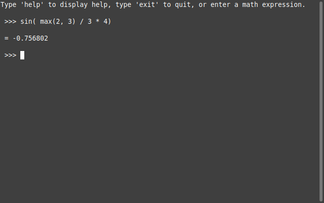

# Calculator
A C++ infix expression evaluator

## Compilation

`g++ -o calc ./src/*.cpp`

## Calculator Features

Supports all basic operations:
- Unary minus
- Addition
- Subtraction
- Multiplication
- Division
- Modulus
- Powers

Supports a variety of functions:
- Square root
- Sin
- Cosine
- Tangent
- Max
- Min
- Floor
- Ceil
- Conversion from degrees to radians
- Conversion from radians to degrees
- Generating random numbers

The calculator evaluates regular infix math expressions which may contain many operations.
- For example: `./calc "3 + 4 * 2 / ( 1 - 5 ) ^ 2 ^ 3"`

The calculator can handle decimal numbers, but it uses a double to do so, which can result in rounding errors for long expressions with many operations or repeating digits. For example the expression "3 + 4 * 2 / ( 1 - 5 ) ^ 2 ^ 3" is more accurately "3.00012207" but the program only displays "3.00012" because of the limitation of doubles.

The calculator operates in terminal mode if started without arguments. Commands and math expressions can be typed in this mode.

The calculator can accept math expressions from command-line arguments and outputs the result of each expression on a new line. This is particularly useful if this program is installed to the path of a user.
- Ex: `./calc "3 + 4 * 2 / ( 1 - 5 ) ^ 2 ^ 3" "-5 - -6"`


## Special considerations for expressions

### Unary minus vs Subtractions
The unary minus operator operates on a single numeric token the comes after it and is evaluated before all other functions or operators. It has the highest precedence. It denotes that a number is negative which is different from the subtraction operator. The subtraction operator requires two operands and denotes that the second should be subtracted from the first numeric token. The reason these use a different symbol is to explicitly force the selection of the correct operator when writing an expression.

The calculator attempts to dynamically select the correct version between the unary and binary minus if the minus symbol is used. Generally if the binary version can be applied it is chosen over the unary version even though the precedence of the unary minus is higher than the binary version in evaluation. This allows statements such as “-5 - -6”, read as “negative five minus negative six”, to be evaluated correctly. The alternative way to write “-5 - -6” is “_5 - _6”. This alternate version avoids the evaluator having to determine if a negative is unary or binary.

### Brackets
Brackets anywhere in an expression are optional because their purpose is to override the usual precedence of operators, however opening and closing brackets must be correctly matched. For example “sqrt(25)”, “sqrt 25” and “(sqrt 25)” will all evaluate to “5”. Functions, however, with more than one argument do require brackets. For example “max 5, 6” is not valid.

Brackets should also be used where the evaluation order is not obvious. For example “sqrt 9 mod 5” will evaluate to “3” because functions have a higher precedence than binary operators. This is not obvious and brackets should be add to make the expression appear as “sqrt(9) mod 5” (which evaluates to 3) or as “sqrt(9 mod 5)” (which evaluates to 2). The later is an example of where brackets would be required to override the usual order of evaluation. Though not required, to avoid such ambiguity, brackets should always be used for functions.

### Spaces
Spaces are ignored when evaluating an expression. For example “5 0 + 5” is evaluated as fifty plus five. This applies to functions as well. For example “sqrt25” and “sqrt 25” will both evaluate to “5”. Spaces are included only for readability. `./calc "-5 - -6"` and `./calc "-5--6"` both result in "1" as well as `./calc "3 + 4 * 2 / ( 1 - 5 ) ^ 2 ^ 3"` and `./calc "3+4*2/(1-5)^2^3"` both result in "3.00012"

### Commas
Commas are only used as token separators for functions arguments. They should not be used as number grouping devices. For example “50,000+10,000” is considered a malformed expression because it would be impossible to correctly evaluate functions with more than one argument.


### Evaluation of Infix Expressions

Due to the complicated nature of evaluating infix expressions on the fly, it is far easier to evaluate expressions which use post-fix. Post-fix expressions are extremely easy for computers to evaluate however people generally don’t naturally write math expressions in post-fix. Therefore the easiest solution is to convert an infix expression to post-fix and evaluate the post-fix expression. This removes the “jumping around” that brackets and order-of-precedence imposes. Expressions can be converted from in-fix to post-fix using an algorithm invented by Edsger Dijkstra (Dijkstra, 1961). This algorithm is logically very simple and only requires a stack and a queue in-terms of data structure requirements. For the purpose of this calculator project, a vector has the functionality of a stack and a queue with the added bonus of being easier to iterate over than an actual stack or queue (which makes implementation easier).


### Program Architecture Notes

*For more detailed notes regarding functions please see the source code header files.


While op_word will likely be a double, all functions should be written in a way that allows op_word to be other common types such as an int, long or float.

`typedef double op_word;`


A custom exception for errors in evaluating math expressions.

```
class EvalException : public std::exception {
private:
	char *msg;
public:
	EvalException(std::string msg);
	char *what();
	~EvalException();
};
```


A class to hold the logic of evaluating infix expressions.

```
class Evaluate {
private:
	// Helper methods and debugging methods
	// These are private because they should not be accessed outside of this class
public:
	static op_word evaluate(std::string &expression, bool basic_or_advanced);
};
```

A class that holds the operations that can be applied to operands in a math expression. Some functions have a second argument “op_word b” which may not be used depending on the function. This allows all methods to have the same general declaration and be differentiated only by name. These general method definitions can then be assigned as values to a method pointer variable. The functions which don’t use the second argument have the second argument hidden from the user. The user would not know that the functions were implemented this way without reading the source code.

```
class Op {
private:

	static op_word uminus(op_word a, op_word b);
	static op_word exp(op_word a, op_word b);
	static op_word mul(op_word a, op_word b);
	static op_word div(op_word a, op_word b);
	static op_word mod(op_word a, op_word b);
	static op_word add(op_word a, op_word b);
	static op_word sub(op_word a, op_word b);
	static op_word sin(op_word a, op_word b);
	static op_word cos(op_word a, op_word b);
	static op_word tan(op_word a, op_word b);
	static op_word max(op_word a, op_word b);
	static op_word min(op_word a, op_word b);
	static op_word floor(op_word a, op_word b);
	static op_word ceil(op_word a, op_word b);
	static op_word rad(op_word a, op_word b);
	static op_word deg(op_word a, op_word b);
	static op_word sqrt(op_word a, op_word b);
	static op_word rnd(op_word a, op_word b);
public:

	enum Association {
		NONE = 0,
		LEFT,
		RIGHT
	};
	
	struct op_struct {
		std::string op;
		int prec;
		enum Association assoc;
		int unary;
		op_word (*eval)(op_word a, op_word b);
	};
	
private:

	static struct op_struct ops[];
	
public:

	static struct op_struct *getop(std::string &op);
};
```


A class to store extra functionality that doesn’t require its own class.

```
class Util {
public:

	// Extra functionality
};
```


## Screenshots


Start-up of calculator.


Help screen in calculator.


Checking which mode the calculator is currently in and switching to the other mode.


Error message resulting from using advanced functions while in basic only mode.


Switching back to advanced mode and evaluating the expression correctly.


For convenience the calculator starts in advanced mode to allow expressions to be entered right away.




Evaluating math expressions passed as program arguments.


